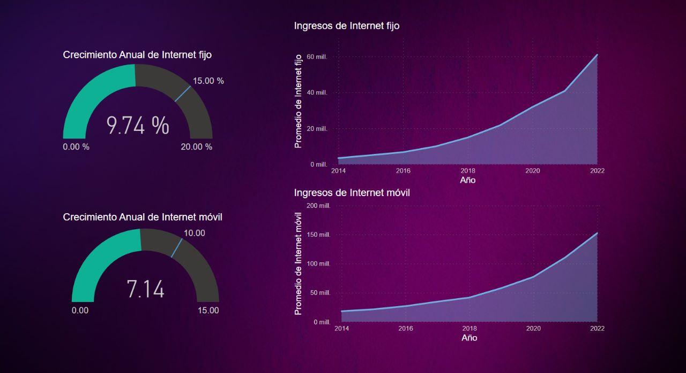
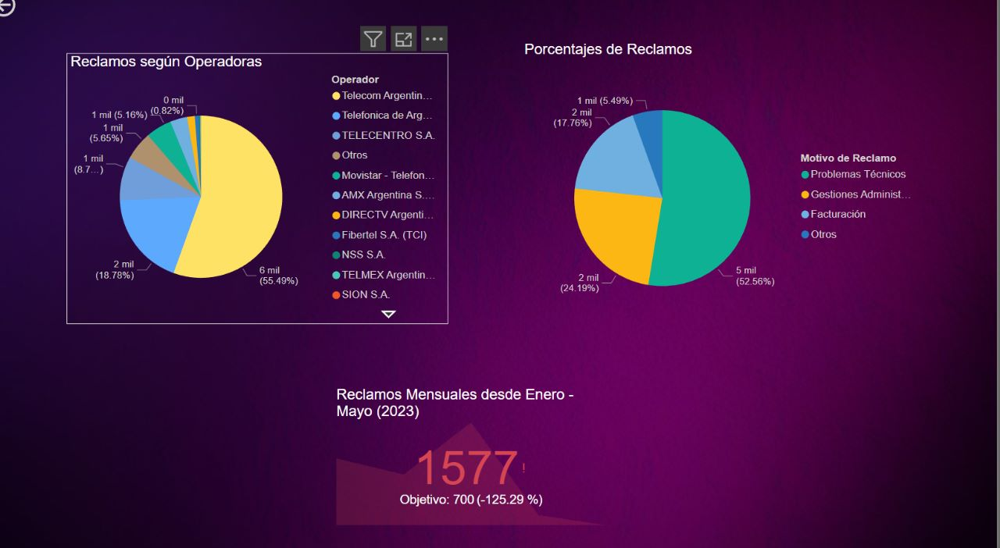
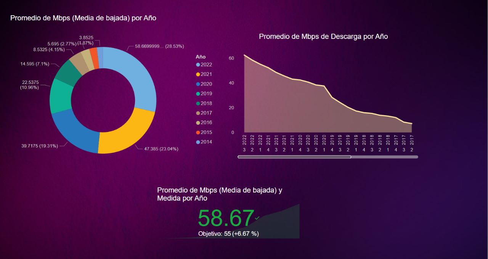

<h1 align='center' style="font-weight:light; text-align:justify; margin-left: 80px; margin-right: 100px;">
  Generación de KPI´s usando técnicas de Análisis de datos para la optimización de servicios de internet para la empresa DELECON en Argentina
</h1>

<h2 align='center'>
  Data  Analyst Role
</h2>

## Definición del Proyecto:

El proyecto tiene como objetivo utilizar técnicas avanzadas de análisis de datos para generar tres Indicadores Clave de Rendimiento (KPIs) que permitan optimizar los servicios de internet ofrecidos por la empresa TELECOM en Argentina.

## Objetivos del proyecto:
---
### Objetivo Principal
1. Generar y establecer KPIs que ayuden a TELECOM a optimizar la calidad de sus servicios de internet y la satisfacción del cliente, así como a enfocar esfuerzos comerciales en segmentos más rentables.

### Objetivos Específicos
1. Determinar si la empresa TELECOM debe incursionar en servicios de internet fijo o móvil basándose en análisis de datos de ingresos percibidos según el tipo de servicio antes mencionado y comportamiento de consumo.

2. Analizar Calidad del servicio de internet en términos de velocidad de bajada promedio para implementar mejoras en el equipo técnico.

3. Proponer mejoras para mejorar la calidad del servicio de internet de TELECOM basándose en el análisis de reclasmos

---
## Resumen de los procesos:
---
### 1. Proceso de Extracción, Transformación, Carga ( _enlace:_ [ETL ](https://github.com/abelfranco/PI_DA/blob/master/ETL.ipynb))

En el archivo **ETL.py**, se llevó a cabo el proceso de extracción de datos de dos fuentes, la transformación de los datos para su limpieza y preprocesamiento, y finalmente la carga de los datos en un formato adecuado (archivo **ds_clean.csv**) para su posterior análisis.

### 2. Análisis Exploratorio de Datos ( _enlace:_ [EDA ](https://github.com/abelfranco/PI_DA/blob/master/EDA.ipynb))

En el notebook **EDA.ipynb**, se realizará un **`INFORME`** de Análisis exhaustivo de los datos para el caso en estudio. Esto incluirá la visualización de los datos, reducción de dimensionalidad, tratamiento de valores atípicos y la generación de conclusiones relevantes entorno a las variables y la elección del modelo.

 

### 3. Power BI ( _enlace:_ [model.py ](https://github.com/abelfranco/PI_ML/blob/master/model.py))

  

  

  

---
----

  

    <h2>Herramientas Utilizadas</h2>
    <ul style="text-align: justify;">
      <li><b>🐍Python</b>: Lenguaje de programación principal utilizado en el desarrollo del proyecto.</li>
      <li><b>🐼Pandas</b>: Utilizado para la manipulación y análisis de datos estructurados.</li>
      <li><b>📈Matplotlib</b>: Utilizado para la visualización de datos y generación de gráficos.</li>
      <li><b>💻Power BI</b>: Herramienta de visualización y análisis de datos</li>   
    </ul>
  

  

   
  

## Fuente de Datos

 [ENACOM Datos Abiertos](https://datosabiertos.enacom.gob.ar/home)

## Autor

Abel Franco Ccapa

- Correo electrónico: abel.ccapa@tecsup.edu.pe

- LinkedIn: [Perfil de LinkedIn](https://www.linkedin.com/in/abelfrancoccapa)
